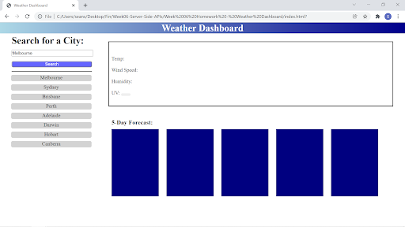

# Week-06-Weather-Dashboard

This application was created to see the weather outlook for multiple cities so that the user can plan a trip accordingly.

The application consists of a weather dashboard with form inputs. When you search for a city via the form input you will be presented with the current and future conditions for that city and that city is added to the list of towns on the side. Once a town is added to the list they will persist even once the page is refreshed or re-entered.

When the user looks at the weather conditions for the search they will be presented with the city name, the date, an icon representation of weather conditions, the temperature, the humidity, the wind speed, and the UV index. When the user views the UV index they are presented with a color that indicates whether the conditions are favorable, moderate, severe or extreme based on the colors green, yellow, orange and red respectively.

When the user views the future weather conditions for that city they are presented with a 5-day forecast that displays the date, an icon representation of weather conditions, the temperature, the wind speed, and the humidity.

Screenshots:

Links:
Deployed Page:
GitHub repo: https://github.com/seanscott95/Week-06-Weather-Dashboard